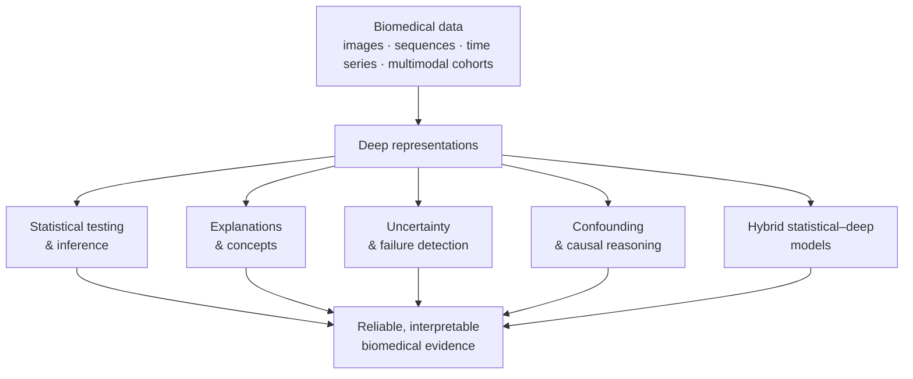

# [DeSBi](https://desbi.de/)

### Deep Learning × Statistics for Biomedical Data

**DFG Research Unit KI-FOR 5363 · Project 459422098**

DeSBi develops **statistically grounded artificial intelligence for biomedical data**. We combine the modelling flexibility of deep learning with statistical inference, uncertainty quantification, explanation, confounder-aware and causal analysis, and structured modelling—so that learned representations can support reliable scientific conclusions rather than prediction alone.

## From biomedical questions to reusable methods

DeSBi methods are co-developed and evaluated across **neuroimaging and imaging genetics**, **histopathology and clinical imaging**, **functional genomics and biological sequence models**, and **longitudinal and multimodal biomedical data**. The application domains expose methodological failure modes; the resulting methods return to the applications as reproducible analysis pipelines and validated scientific tools.

## Curated DeSBi releases (v1.0.0, desbi-2026.09.1)

All 10 repositories with verified v1.0.0 releases:

| | | |
|---|---|---|
|  |  |  |
|  |  |  |
|  |  |  |
|  | | |

Each release includes provenance-verified snapshots, citation metadata (CITATION.cff, DESBI_RELEASE.md), and full upstream history. See **[what a DeSBi release means](#what-desbi-release-means)** for details.

## Flagship software

Key methodological contributions spanning statistical inference to mechanistic interpretability:

| | | |
|---|---|---|
| <a href="https://github.com/dfg-desbi/DNCIT"><strong>DNCIT</strong></a> Conditional-independence testing with learned representations. Inference · R · v1.0.0 ✓ | <a href="https://github.com/dfg-desbi/transferGWAS"><strong>transferGWAS</strong></a> Genome-wide association analysis on whole medical images. Imaging genetics · Python · v1.0.0 ✓ | <a href="https://github.com/dfg-desbi/semanticlens"><strong>SemanticLens</strong></a> Semantic interpretation and validation of components in large vision models. Mechanistic XAI · Python · v1.0.0 ✓ |
| <a href="https://github.com/dfg-desbi/MFD"><strong>MFD</strong></a> Metadata-guided feature disentanglement for functional genomics. Genomics · Python/Snakemake · v1.0.0 ✓ | <a href="https://github.com/dfg-desbi/quanda"><strong>quanda</strong></a> Quantitative evaluation of training-data attribution methods. Evaluation · Python · candidate ⏳ | <a href="https://github.com/dfg-desbi/PURE"><strong>PURE</strong></a> Turning polysemantic neurons into pure features by identifying relevant circuits. Mechanistic XAI · Python · candidate ⏳ |
| <a href="https://github.com/dfg-desbi/DualXDA"><strong>DualXDA</strong></a> Sparse, efficient and feature-explainable data attribution. Data attribution · Python · v1.0.0 ✓ | <a href="https://github.com/dfg-desbi/pcx"><strong>pcx</strong></a> Prototypical concept-based explanations for model validation. Mechanistic XAI · Python · candidate ⏳ | <a href="https://github.com/dfg-desbi/aggrigator"><strong>aggrigator</strong></a> Spatially-aware aggregation of segmentation uncertainty. Uncertainty · Python · candidate ⏳ |

**Status labels:** v1.0.0 ✓ = curated release · candidate ⏳ = undergoing review

## Release candidates

These repositories are undergoing independent review and will receive curated DeSBi releases:

- **[quanda](https://github.com/dfg-desbi/quanda)** – Quantitative evaluation of training-data attribution methods
- **[PURE](https://github.com/dfg-desbi/PURE)** – Turning polysemantic neurons into pure features
- **[pcx](https://github.com/dfg-desbi/pcx)** – Prototypical concept-based explanations
- **[aggrigator](https://github.com/dfg-desbi/aggrigator)** – Spatially-aware aggregation of segmentation uncertainty
  

## Software catalogue

Additional research software is documented in the **[complete software catalogue](https://github.com/dfg-desbi/software-catalogue)**:

- **[zennit](https://github.com/dfg-desbi/zennit)** – Layer-wise relevance propagation for PyTorch
- **[LRP-eXplains-Transformers](https://github.com/dfg-desbi/LRP-eXplains-Transformers)** – Explaining transformer models
- **[toybrains](https://github.com/dfg-desbi/toybrains)** – Causal synthetic neuroimaging benchmark
- **[arctique](https://github.com/dfg-desbi/arctique)** – Controllable synthetic histopathology
- **[DeepRepViz](https://github.com/dfg-desbi/DeepRepViz)** – Diagnostics for confounder encoding
  

## What "DeSBi release" means

An official release is more than a fork. Each curated DeSBi release must:

- preserve the upstream authors, commit history, licence and canonical development link;
- identify the DeSBi projects, publication, funding and scientific contribution;
- provide machine-readable citation metadata and a versioned release note;

The detailed requirements are defined in the **[release policy](https://github.com/dfg-desbi/software-catalogue/blob/main/RELEASE_POLICY.md)** and **[repository checklist](https://github.com/dfg-desbi/software-catalogue/blob/main/REPO_CHECKLIST.md)**.

## Use, cite and contribute

Use the licence and citation instructions of the individual repository. Unless explicitly stated otherwise, the original repository remains the canonical development home and the DeSBi repository provides a provenance-preserving, independently-verified research release.

New or previously unlisted software can be proposed through the **[release-candidate form](https://github.com/dfg-desbi/software-catalogue/issues/new?template=release-candidate.yml)**.

---

DeSBi is funded by the German Research Foundation (DFG) under project 459422098, KI-FOR 5363. Repository licences and copyright remain those of the respective upstream projects.

