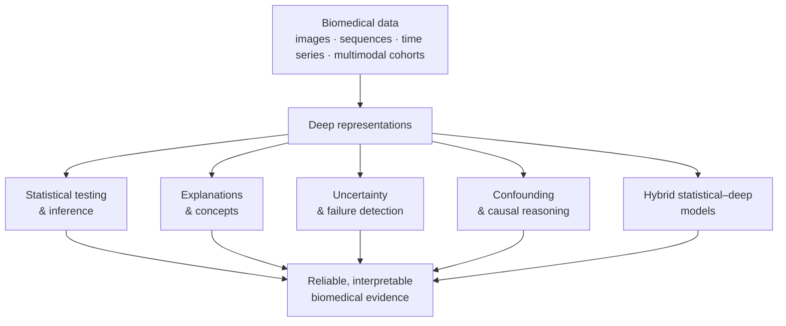

# [DeSBi](https://desbi.de/)

### Deep Learning × Statistics for Biomedical Data

**DFG Research Unit KI-FOR 5363 · Project 459422098**

DeSBi develops **statistically grounded artificial intelligence for biomedical data**. We combine the modelling flexibility of deep learning with statistical inference, uncertainty quantification, explanation, confounder-aware and causal analysis, and structured modelling—so that learned representations can support reliable scientific conclusions rather than prediction alone.

## Flagship software

<table>
<tr>
<td width="33%"><a href="https://github.com/dfg-desbi/DNCIT"><strong>DNCIT</strong></a> Conditional-independence testing with learned representations. Inference · R</td>
<td width="33%"><a href="https://github.com/dfg-desbi/transferGWAS"><strong>transferGWAS</strong></a> Genome-wide association analysis on whole medical images. Imaging genetics · Python</td>
<td width="33%"><a href="https://github.com/dfg-desbi/quanda"><strong>quanda</strong></a> Quantitative evaluation of training-data attribution methods. Data attribution · Python</td>
</tr>
<tr>
<td width="33%"><a href="https://github.com/dfg-desbi/arctique"><strong>Arctique</strong></a> Controllable synthetic histopathology for uncertainty benchmarking. Uncertainty · Python/Blender</td>
<td width="33%"><a href="https://github.com/dfg-desbi/semanticlens"><strong>SemanticLens</strong></a> Semantic interpretation and validation of components in large vision models. Mechanistic XAI · Python</td>
<td width="33%"><a href="https://github.com/dfg-desbi/MFD"><strong>MFD</strong></a> Metadata-guided feature disentanglement for functional genomics. Genomics · Python/Snakemake</td>
</tr>
<tr>
<td width="33%"><a href="https://github.com/dfg-desbi/DeepRepViz"><strong>DeepRepViz</strong></a> Diagnostics for confounder encoding in deep representations. Confounding · Python</td>
<td width="33%"><a href="https://github.com/dfg-desbi/toybrains"><strong>Toybrains</strong></a> Causal synthetic neuroimaging benchmark with known ground truth. Simulation · Python</td>
<td width="33%"><a href="https://github.com/dfg-desbi/DualXDA"><strong>DualXDA</strong></a> Sparse, efficient and feature-explainable data attribution. Data attribution · Python</td>
</tr>
</table>

**[Browse the complete software catalogue →](https://github.com/dfg-desbi/software-catalogue)**

## From biomedical questions to reusable methods

DeSBi methods are co-developed and evaluated across **neuroimaging and imaging genetics**, **histopathology and clinical imaging**, **functional genomics and biological sequence models**, and **longitudinal and multimodal biomedical data**. The application domains expose methodological failure modes; the resulting methods return to the applications as reproducible analysis pipelines and validated scientific tools.

## What “DeSBi release” means

An official release is more than a fork. Each curated DeSBi release must:

- preserve the upstream authors, commit history, licence and canonical development link;
- identify the DeSBi projects, publication, funding and scientific contribution;
- provide an installable environment, a minimal reproducible example and automated checks;
- carry machine-readable citation metadata and a versioned release note;
- be archived with a persistent identifier where appropriate.

The detailed requirements are defined in the **[release policy](https://github.com/dfg-desbi/software-catalogue/blob/main/RELEASE_POLICY.md)** and **[repository checklist](https://github.com/dfg-desbi/software-catalogue/blob/main/REPO_CHECKLIST.md)**.

## Use, cite and contribute

Use the licence and citation instructions of the individual repository. Unless explicitly stated otherwise, the original repository remains the canonical development home and the DeSBi repository provides a provenance-preserving, quality-checked research release.

New or previously unlisted software can be proposed through the **[release-candidate form](https://github.com/dfg-desbi/software-catalogue/issues/new?template=release-candidate.yml)**.

---

DeSBi is funded by the German Research Foundation (DFG) under project 459422098, KI-FOR 5363. Repository licences and copyright remain those of the respective upstream projects.

